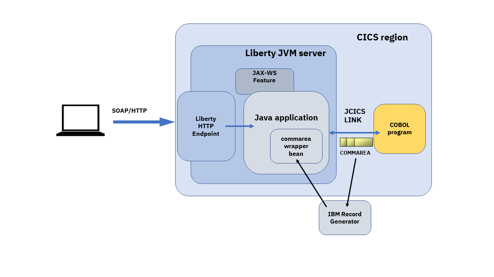
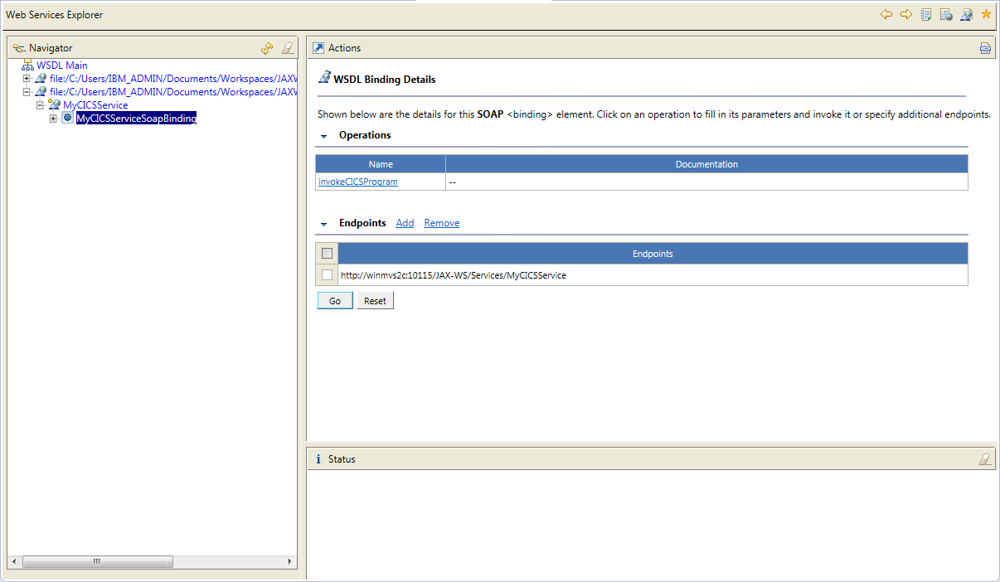

# Developing a JAX\-WS Web service for Liberty in CICS

The aim of this article is to show how you can develop a web service in Java using the JAX\-WS API and deploy this application directly into a Liberty JVM server running within CICS. It is intended for Java developers and CICS system programmers that have little knowledge of the Liberty JVM server environment. 
It is based on an original article by Giovanni Creato.

The diagram below shows the overall view of how CICS will act as a web service provider. return the result to the caller.

The flow will be as follows:

1.  HTTP web service request will be accepted by the Liberty HTTP listener
1.  The Java application using the JAX\-WS API will parse the web services request
1.  The Java application calls an existing CICS COBOL program using the JCICS API passing a record created using the IBM Record Generator
1.  The COBOL program will return data in a COMMAREA to the Java application
1.  The Java application will parse the returned data using a helper class, and then a response returned to the caller.

## Prerequisites

Before running through this tutorial you should have the following resources in place:

- CICS region (CICS TS V5.2) or later
- A Liberty JVM server with the following features added:
    - `cicsts:core-1.0`
    - `jaxws-2.2` or `jaxws-2.3`
- Java SE 1.8 on the z/OS system
- Java SE 1.8 on the workstation
- An Eclipse development environment on the workstation including:	
    * CICS Explorer SDK for Java support
    * CICS SDK for Web and JSP support
	* Web Sphere developer tools 
	* z/OS Explorer (if you intend to move generated artefacts to z/OS)
    
To develop Java programs for CICS you can use any development environment you are familiar with. In this tutorial we are using the Eclipse environment with the CICS Explorer SDK for Java.
For details on how to set up your development environment please refer to 
[Setting up the development environment](https://www.ibm.com/support/knowledgecenter/SSGMCP_5.6.0/applications/developing/java/installingthelibertyprofile.html).

For details on how to configure a Liberty JVM server please refer to [this topic](https://www.ibm.com/support/knowledgecenter/SSGMCP_5.6.0/configuring/java/config_jvmserver_liberty.html)

## Supporting material
The Java sample code from this article is available for download and can be imported into an Eclipse IDE using using the following procedure:

1.  Create a dynamic Web project in Eclipse
1.  Download the Java source from the [cics-java-liberty-jaxws](https://github.com/cicsdev/cics-java-liberty-jaxws) 
1.  Unzip the archive and copy the `com/ibm/cicsdev/bean` and `com/ibm/cicsdev/ws` folders into the `Java Resources/src` folder of the Eclipse dynamic web project
1.  Optionally download the `MyCICSService.wsdl` and copy into the Eclipse project if you want to test the service

The CICS COBOL sample can be downloaded from the [cics-java-jzosprog](https://github.com/cicsdev/cics-java-jzosprog) GitHub repository

In the following sections you will develop the actual Java code that will expose a web service on you CICS region using JAX\-WS. This web service will interact with an existing CICS program using the JCICS API. For more details on using the JCICS API refer to [Developing Java web applications to run in Liberty JVM](http://www.ibm.com/support/knowledgecenter/SSGMCP_5.6.0/com.ibm.cics.ts.java.doc/topics/dfhpj_devjavaweb.html).

### Create input and output messages

We will use JAX\-WS annotations on a POJO to expose a Java class as a web service. 
In order to expose only the input and output messages we are interested we created a `ResponseWrapper` class for the web service response, which then provides a set of accessor fields for the results code and text to 
bo returned by the CICS COBOL program. 


```java
public class ResponseWrapper {
	
	int resultCode;
	String resultText;
	
	public int getResultCode() {
		return resultCode;
	}
	public void setResultCode(int resultCode) {
		this.resultCode = resultCode;
	}
	public String getResultText() {
		return resultText;
	}
	public void setResultText(String resultText) {
		this.resultText = resultText;
	}
	public ResponseWrapper(int resultCode, String resultText) {
		super();
		this.resultCode = resultCode;
		this.resultText = resultText;
	}
	
}
```
 

### Create the  web service

In this section we will develop a POJO and annotate it with JAX\-WS annotations. 
In the snippet below the `@WebService` annotation defines the class `MyCICSService` as a web service endpoint, and the `@WebMethod` annotation defines the `invokeCICSProgram()` method as a business method that will be exposed to a web service requester. 
This takes a set of data types as input parameters to our CICS program EDUPGM

```java
@WebService(name="MyCICSService")
public class MyCICSService {

    @WebMethod
    public ResponseWrapper invokeCICSProgram( int binaryDigit, String characterString, long numericString,
    BigDecimal packedDecimal, long signedDecimal, String bool ){
    …
    }
}
```

### Develop the business logic

This section focuses on the Java business logic of the web service. In this section we will:

1.  Use the Java wrapper to map input parameters to the binary structure that will be used to link to a CICS program
2.  Invoke the CICS COBOL program using JCICS API
3.  Map the response received from the CICS program to the web service response

#### 1. Map input parameters to the binary structure

COBOL programs invoked using the JCICS LINK API generally require a binary record based structure for input and output when using a CICS COMMAREA.
You can use  either the IBM Record Generator for Java or the Rational J2C tools to create Java helper classes to marshall the data.

The COMMAREA used by our sample COBOL CICS program is a simple record based structure as follows.

```COBOL
03 DATA-PAYLOAD.
  05 BINARY-DIGIT               PIC 9(4) COMP.
  05 CHARACTER-STRING           PIC X(30).
  05 NUMERIC-STRING             PIC 9(18).
  05 PACKED-DIGIT               PIC 9(15) COMP-3.
  05 PACKED-DIGIT-WITH-COMMA    PIC 9(12)V9(3) COMP-3.
  05 SIGNED-PACKED              PIC S9(12) COMP-3.
  05 BOOL                       PIC X.
    88 BOOL-FALSE               value X'00'.
    88 BOOL-TRUE                value X'01' through X'FF'.
  05 RESULT.
    09 RESULT-CODE              PIC S9(5) VALUE +0.
    09 RESULT-TEXT              PIC X(25).
```

In our case the COMMAREA structure contains both the intput and output data. The input `DATA-PAYLOAD` is a set of numeric values, and the `OUTPUT` result a numeric code and a text string.

We used the IBM Record Generator to create a Java helper class `CommareaWrapper` based on this COMMAREA. This is used to both build the record and parse the response. 
The record generator uses the `com.ibm.jzos.fields` package which contains data-type converters for native language structure elements. 
The package is part of the IBM JZOS toolkit and is supplied with the Java SDK on z/OS in ibmjzos.jar. It required to both generate and execute the Java classes, and must be added to the 
Eclipse project build path to compiler the sample.
For further details on using the IBM record generator refer to this article [Building Java records from COBOL with IBM JZOS](https://developer.ibm.com/cics/2016/05/12/java-cics-using-ibmjzos/)

>Note: For details on the alternative Rational J2C tool, refer to this article [Generating Java Records from COBOL with Rational J2C Tools](https://developer.ibm.com/cics/2016/06/29/java-cics-using-rational-j2c/)


We can then use the following Java setter methods in our `MyCICSService` class to populate fields in the  `CommareaWrapper` class as follows:

```java
CommareaWrapper commareaWrapper = new CommareaWrapper();
commareaWrapper.setBinaryDigit(binaryDigit);
commareaWrapper.setCharacterString(characterString);
commareaWrapper.setNumericString(numericString);
commareaWrapper.setPackedDigit(packedDecimal);
commareaWrapper.setSignedPacked(signedDecimal);
commareaWrapper.setBool(bool);
```

#### Invoke the CICS COBOL program

Now that we have built a record object, we can build a byte array from this usng the `getByteBuffer()` method and then pass this into CICS using a COMMAREA with the [JCICS](http://www.ibm.com/support/knowledgecenter/SSGMCP_5.6.0/com.ibm.cics.ts.java.doc/topics/dfhpjlp.html) version of an `EXEC CICS LINK` command.
This can be achieved using the `link()` method on the `com.ibm.cics.server.Program` class as shown.

```java
Task t = Task.getTask();
 
if ( t == null ){
   System.err.println("LinkProgram : Can't get Task");
}
 
else
{
   Program programToLink = new Program();
   programToLink.setName(cicsProgram);
 
   try {
      programToLink.link(commareaWrapper.getByteBuffer()); 
      result = "OK";
   } catch (CicsConditionException e) {
      System.err.println("An error occurred");
      System.err.println("Message " + e.getMessage());
   }
}
```

#### 3. Map the response received from the CICS program 

Next we need to check the respone from CICS using the generated `getResultCode()` and `getResultText()` methods on the CommareaWrapper. 
Then once returned from the CICS program we can simply map the received results to the web service `ResponseWrapper`.

```java
ResponseWrapper response = new ResponseWrapper(commareaWrapper.getResultCode(), commareaWrapper.getResultText());
```

Congratulations you have now finished developing your CICS Liberty JAX\-WS web service that invokes an existing CICS program.

## Deployment 


There are several ways to deploy a Web application into a CICS Liberty JVM server:


- You can either add an <application> element in the Liberty server.xml which points directly to the WAR
- Or you can add the WAR to a CICS bundle project and export this to CICS and install using a CICS BUNDLE resource definition.
- Or you can use the Liberty dropins folder to dynamically load applications.
 
For more details on the deployment process please refer to the Knowledge Center topic [Deploying applications to a JVM server](http://www.ibm.com/support/knowledgecenter/SSGMCP_5.6.0/com.ibm.cics.ts.java.doc/topics/dfhpjlp.html).

### Testing the web service

Now that you have deployed your application you can test the web service using a web service client. For example you could use the web service Explorer provided by IBM Developer for z/OS. 
To find the address at which your web service is available you can look in the Liberty messages.log file for the message **CWWKT0016I** showing the application is available and URL to be used.

```
CWWKZ0018I: Starting application OSGiApplication
SRVE0169I : Loading Web Module: com.ibm.cicsdev.ws
SRVE0250I : Web Module com.ibm.cicsdev.ws has been bound to default_host
CWWKT0016I: Web application available (default_host): http://hostname:port/JAX-WS/Services/
CWWKZ0001I: Application com.ibm.cicsdev.ws.app started in 1.914 seconds.
```

You also need to obtain the WSDL that describes the web service. You can either downlaod the sample supplied with this tutorial or you can use the following style query to obtain this from the Liberty server:

`http://hostname:port/JAX-WS/Services/MyCICSService?WSDL`

Once you have the WSDL copy this into the Eclipse project you are using and open the Eclipse *Web Services Explorer* using the context menu **Web Services \-> Test with Web Services Explorer**. This should display the following.



### Invoking the service

To test your web service you will need to:

1.  Validate that the Endpoints in the WSDL contains the correct URL for your HTTP listener.
2.  Click on the business method **invokeCICSProgram** which was annotated as a `@WebMethod`, this will open a dialog listing the required input parameters which correspond to the COBOL datatypes required in the EDUPGM copybook.
You can use the following test values to validate the function.

| Input | Type | COBOL type | test value |
| --- | --- | --- | --- |
| arg0 | int | BINARY-DIGIT | 1 |
| arg1 | string | CHARACTER\-STRING | hello |
| arg2 | long | NUMERIC\-STRING | 123456789 |
| arg3 | long | PACKED\-DECIMAL | 987654321 |
| arg4 | long | SIGNED\-PACKED | \-987654321 |
| arg5 | string | BOOLEAN | 1 |

Now you can experiment invoking your web service. If your service is working correctly you should see the following message from EDUPGM returned in the *Status* window of the Web Services Explorer.

`PARAMETERS ARE ALL OK`

If you experience any problems with the validation of the properties then you can check the output of the COBOL DISPLAY debugging which will write output similar to the following in the CEEMSG log in your CICS job output
```
     CJSA 20160418160446 EDUPGM  : Starting
     CJSA 20160418160446 EDUPGM  : PARTIAL SUM IS  :    58
     CJSA 20160418160446 EDUPGM  : PARTIAL SUM IS  :    65
     CJSA 20160418160446 EDUPGM  : PARTIAL SUM IS  :    71
     CJSA 20160418160446 EDUPGM  : PARTIAL SUM IS  :    96
     CJSA 20160418160446 EDUPGM  : MINIMUM COMMAREA LENGTH IS :   104
     CJSA 20160418160446 EDUPGM  : Performing Business Logic
     CJSA 20160418160446 EDUPGM  : Returning with RESULT-CODE :     0
     CJSA 20160418160446 EDUPGM  : Performing END-PROGRAM
```

## Summary

This article has shown you how you can use the CICS Liberty JVM server to expose an existing CICS program as a web service using the JAX\-WS specification.
The article guided you though the main aspects to take into account when developing JAX\-WS web services in the CICS Liberty JVM server. 


